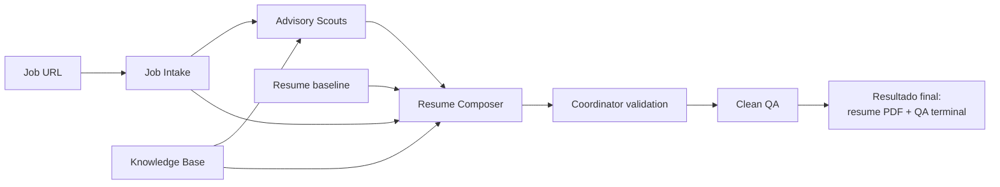

# Resume as Code

Proyecto para mantener un historial profesional verificable, componer un CV de
una pagina para una oferta concreta y evaluar solamente el PDF que recibiria la
empresa.

Repositorio publico:
[vercinbleach/resume-as-code-ai-tailoring-system](https://github.com/vercinbleach/resume-as-code-ai-tailoring-system)

## Flujo actual



La arquitectura completa, sus fronteras y cada bloque estan documentados en
`docs/system-architecture-diagrams.md`.

## Estructura

- `knowledge-base/`: historial profesional canonico en Markdown y claims
  verificables cuando existen.
- `tailoring/`: sesiones, snapshots, advisory scouts y composicion por oferta.
- `resumes/`: fuente RenderCV canonica y variantes experimentales.
- `qa/`: QA limpio del PDF final con evaluadores Codex aislados.
- `.sandbox/`: workspaces privados y efimeros por task; no contiene resultados
  durables.
- `docs/`: arquitectura, decisiones e investigacion vigente.
- `archive/`: CV anteriores y snapshots historicos que no deben editarse.
- `output/`: artefactos generados; nunca es fuente de verdad.

## Generar el CV base

La fuente canonica es `resumes/vincenzo-rosciano-one-page.yaml`. RenderCV 2.8
usa el tema `sb2nov`, inspirado en Jake's Resume.

```powershell
.\scripts\build-resume.ps1
```

El PDF base se genera en `output/pdf/vincenzo-rosciano-one-page.pdf`.

## Tailoring para una oferta

La arquitectura activa usa dos etapas semanticas:

1. Advisory scouts en tasks Codex top-level nuevas con `gpt-5.6-terra` y
   reasoning `xhigh`. Sus reportes ayudan a localizar relevancia, riesgos,
   contradicciones y oportunidades, pero no son gates obligatorios ni escriben
   el CV.
2. Una sola Resume Composer task top-level nueva con `gpt-5.6-sol` y reasoning
   `high`. Recibe el baseline, la oferta normalizada, los reportes de scouts y
   copias completas de todos los Markdown de `knowledge-base/experience/` y
   `knowledge-base/projects/`.

El Resume Composer trabaja con la foto completa. Planifica el CV global, evita
duplicaciones entre experiencia y proyectos, decide bullets, proyectos, links y
technical skills, escribe el YAML por oferta, renderiza el PDF e inspecciona
visualmente su propio resultado. No inventa evidencia ni modifica el baseline o
la knowledge base.

El coordinator verifica inputs, hashes, estructura, una pagina, PDF preflight y
la integridad del bundle antes de promoverlo. Los scripts y contratos de una
orquestacion anterior pueden permanecer como codigo no invocado, pero no forman
parte de la arquitectura activa.

## Ejecutar Clean QA

```powershell
.\qa\resume-qa\scripts\setup.ps1

.\qa\resume-qa\scripts\start-session.ps1 `
  -Resume .\tailoring\sessions\<session-id>\composer\resume.pdf `
  -Modes technical,leadership,job-match,callback `
  -JobIntake .\qa\jobs\<job-slug>\job-intake.json

# Despues de completar los outbox/result.json seleccionados
.\qa\resume-qa\scripts\finalize-session.ps1 `
  -Session .\qa\sessions\<session-id>
```

Cada evaluator recibe una copia read-only de su skill y solo sus inputs
permitidos dentro de un sandbox privado. No recibe knowledge base, outputs de
scouts, workspace del Composer, navegador, chat padre, CV anteriores ni reportes
previos. Clean QA es terminal: no devuelve reportes al Composer ni dispara una
segunda composicion automatica.

El sistema termina en un resume PDF candidato y su QA terminal. Completar y
enviar la candidatura queda fuera de alcance; Job Intake solo puede inspeccionar
el contenido visible de Apply.

El sandbox v1 es aislamiento logico para procesos del mismo usuario, no una
frontera de seguridad del sistema operativo. No anade contenedores, VMs,
firewall, bloqueo tecnico de red, sandboxes calientes, JSONL ni telemetria. Su
alcance aprobado esta en `docs/lightweight-sandbox-v1-scope.md`.

## Documentacion canonica

- `docs/README.md`: indice y reglas de vigencia documental.
- `docs/system-architecture-diagrams.md`: arquitectura completa.
- `docs/lightweight-sandbox-v1-scope.md`: alcance y limites del sandbox v1.
- `docs/writer-orchestration-v1-scope.md`: contrato del Resume Composer.
- `docs/research/resume-as-code.md`: decision de renderer.
- `tailoring/README.md`: scouts advisory, Resume Composer y promocion.
- `qa/README.md`: Clean QA v7.
- `knowledge-base/README.md`: conocimiento canonico y claims.

## Licencia

El codigo y la documentacion de este repositorio se publican bajo la licencia
MIT. Consulta `LICENSE`.
