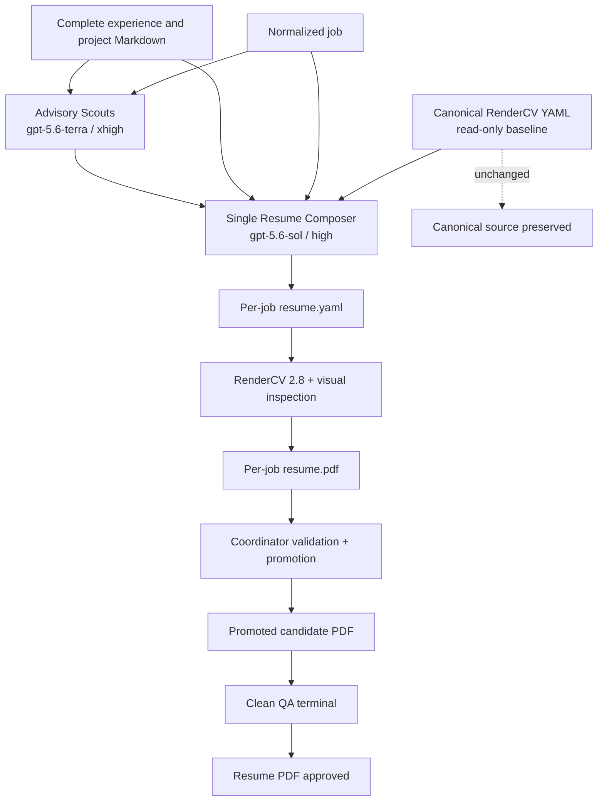

# Decision record: Resume as Code renderer

- Decision date: 2026-07-16
- Status: accepted and implemented
- Current renderer: RenderCV 2.8
- Current theme: `sb2nov`
- Canonical source: `resumes/vincenzo-rosciano-one-page.yaml`

## Objective

Generate a selectable, ATS-readable, one-page PDF inspired by Jake's Resume
while keeping professional history and evidence independent from the renderer.

## Decision

Use RenderCV 2.8 with a pinned dependency and the `sb2nov` theme. Render the
canonical source through:

```powershell
.\scripts\build-resume.ps1
```

Keep Markdown knowledge, advisory analysis, semantic composition, and clean QA
outside RenderCV. The Resume Composer never edits the canonical YAML. It writes
and renders a job-specific candidate in its private workspace; the coordinator
validates and promotes the bundle under its job session. A PDF is an
employer-facing artifact, never a source of truth.

## Why RenderCV

- YAML source works well with version control and review.
- The CLI produces a text-extractable PDF and supports repeatable builds.
- `sb2nov` provides the closest maintained starting point to Jake's Resume.
- Typst output avoids maintaining a custom LaTeX renderer for the canonical CV.
- Theme variants can be compared without changing the knowledge model.

Primary references:

- https://github.com/rendercv/rendercv
- https://docs.rendercv.com/user_guide/cli_reference/
- https://docs.rendercv.com/ats_compatibility/

## Alternatives considered

### YAMLResume

YAMLResume provides a Jake-inspired LaTeX template and useful CLI, but was not
selected after the local visual comparison. It remains a possible interchange
or fallback renderer, not a project dependency.

- https://yamlresume.dev/docs/layouts/latex/templates/jake
- https://github.com/yamlresume/yamlresume

### JSON Resume

JSON Resume is useful as an interchange schema, but its standard themes do not
provide the required control over the current Jake-style PDF.

- https://jsonresume.org/
- https://jsonresume.org/cli

### Direct LaTeX

`resumes/vincenzo-rosciano-jake.tex` and
`scripts/build-resume-jake-latex.ps1` remain comparison artifacts. They are not
the canonical build path.

### Local custom renderer

A custom renderer was deferred because RenderCV already meets the current
layout, extraction, link, and one-page requirements. Reconsider only if a
verified visual or ATS requirement cannot be expressed through RenderCV.

## Current system boundary



The Composer receives the complete baseline, normalized job, all advisory
reports, and full experience and project Markdown snapshots. It composes the
resume globally, renders it, and visually inspects the PDF. The coordinator owns
deterministic validation and atomic promotion. Clean QA receives the promoted
PDF and the allowed normalized job description, then terminates the pipeline.

The full implemented architecture is documented in
`docs/system-architecture-diagrams.md`.
