# Atlas visual de la arquitectura del resume

Estos diagramas representan la arquitectura activa simplificada. El sistema
compone un resume global por oferta, promueve un PDF validado y termina en Clean
QA. Completar y enviar la candidatura queda fuera de alcance.

## 0. Vista simplificada por bloques

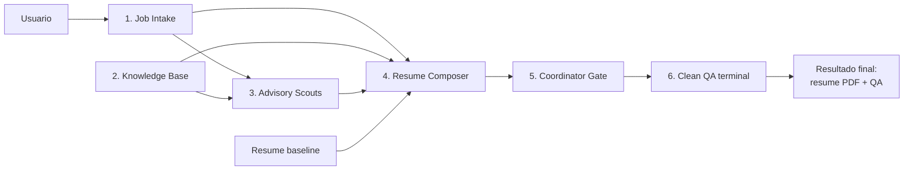

## 1. Arquitectura general completa

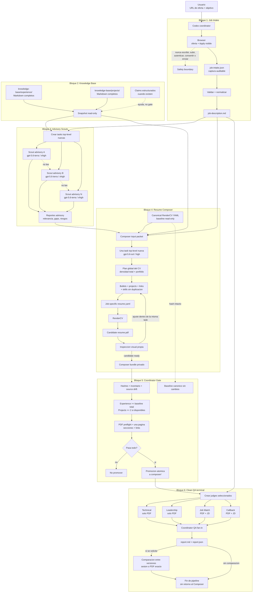

## 2. Bloque Job Intake

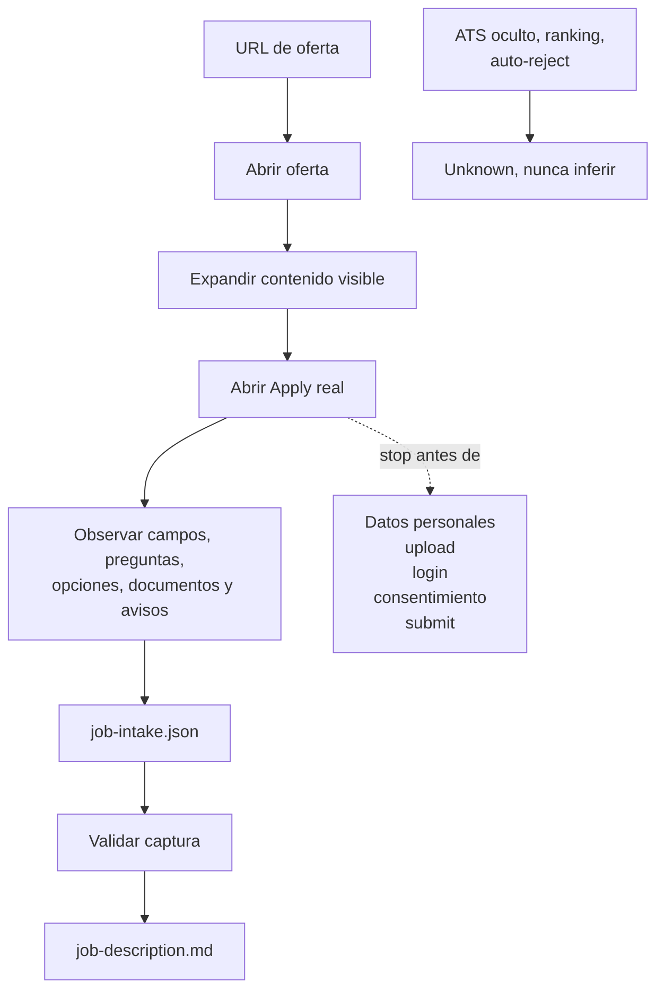

Job Intake crea evidencia observable de la oferta. No completa la candidatura y
no convierte reglas ocultas del ATS en supuestos del sistema.

## 3. Bloque Knowledge Base

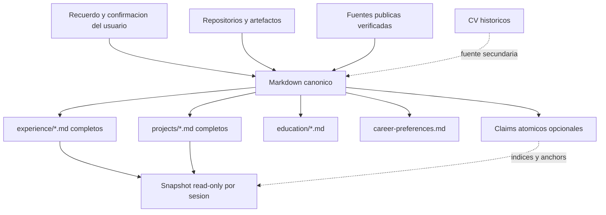

Los archivos Markdown completos son la fuente de contexto del Composer. Los
claims estructurados ayudan a localizar y verificar, pero no sustituyen el
texto completo ni requieren un gate semantico separado.

## 4. Bloque Advisory Scouts

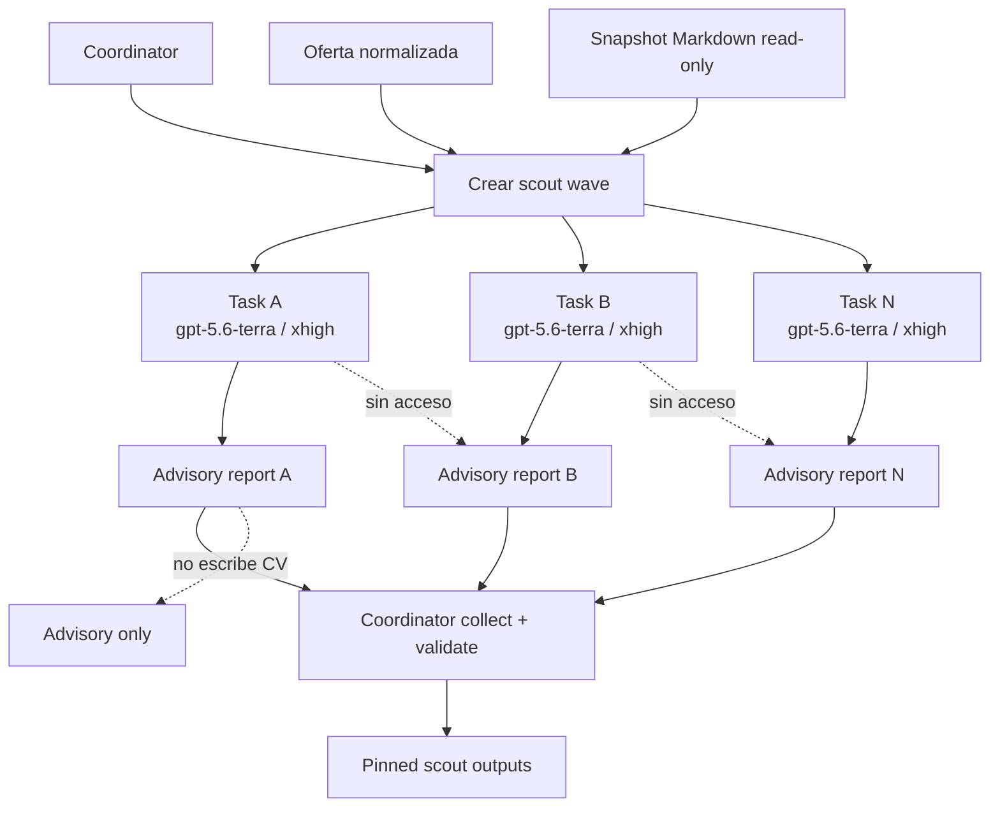

Los scouts amplian cobertura y reducen puntos ciegos. Un scout puede señalar
riesgo, pero su reporte sigue siendo advisory y no bloquea por si solo. No hay
gates semanticos adicionales antes de la composicion.

## 5. Bloque Resume Composer

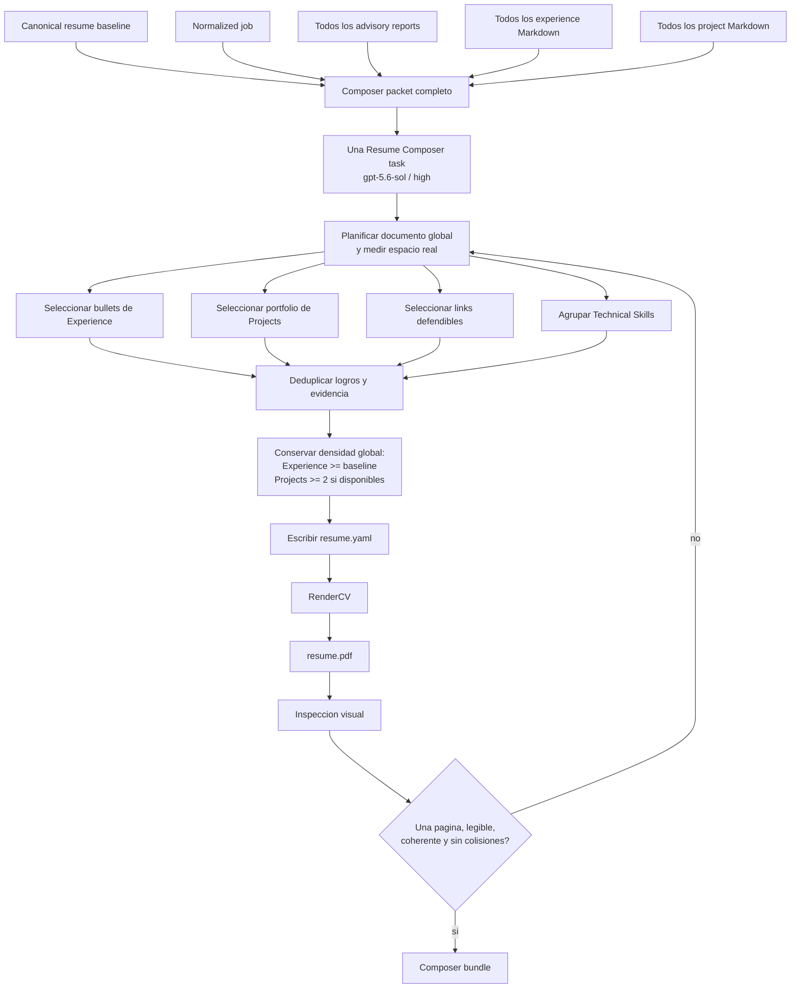

El Composer decide el CV como un solo producto. Puede intercambiar espacio entre
secciones y detectar redundancia que un Writer por seccion no puede resolver. No
edita la knowledge base ni el baseline canonico.

## 6. Bloque Coordinator Gate

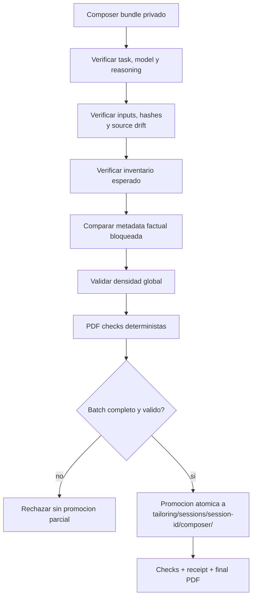

El coordinator valida y promueve. No reescribe contenido semantico ni fusiona
resultados de Writers por seccion.

## 7. Bloque Clean QA terminal

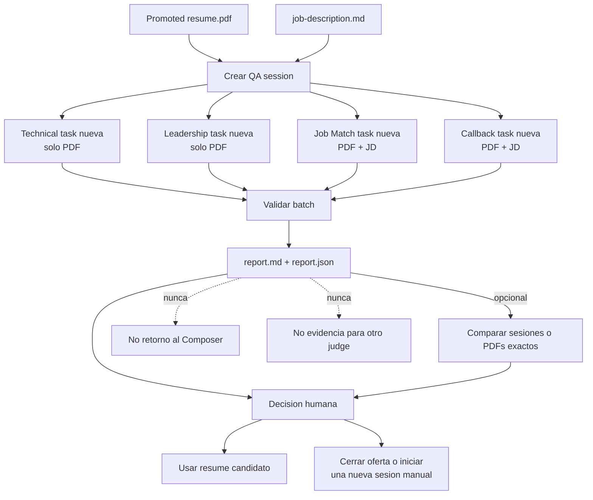

Clean QA juzga el artefacto final sin contexto de construccion. Es terminal: no
existe repair automatico ni una segunda pasada del Composer. Una comparacion
posterior pertenece al coordinator, nunca entra en los prompts de los judges y
no transfiere scores antiguos a un PDF modificado.

## 8. Fronteras de acceso por artefacto

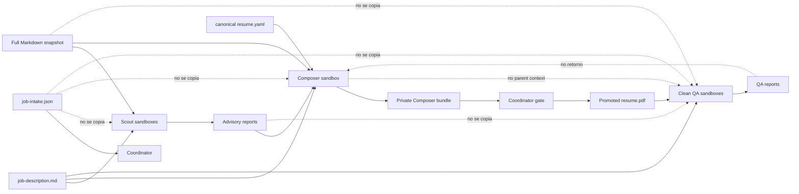

Las aristas `no se copia` son controles del coordinator sobre inputs. No
representan una frontera de seguridad del sistema operativo.

## 9. Sandbox ligero v1

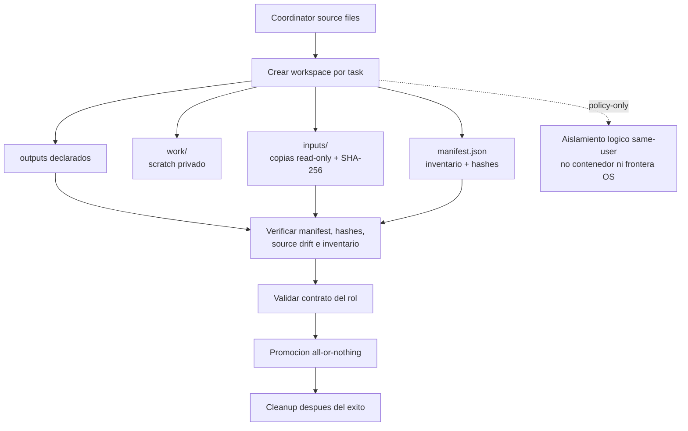

Esta version no incorpora contenedores, VMs, identidades separadas, firewall,
bloqueo tecnico de red, sandboxes calientes, JSONL, telemetria, scheduler ni
retries automaticos.

## 10. Roles activos

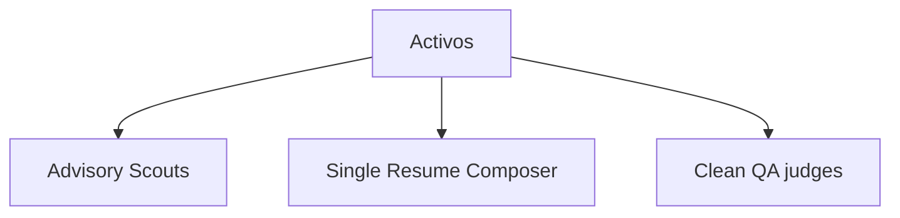

Los archivos legacy de orquestaciones anteriores pueden seguir presentes para
trazabilidad, pero no se invocan en una sesion activa ni definen la arquitectura
vigente.

## Lectura rapida

- Job Intake observa y normaliza la oferta.
- La Knowledge Base conserva todos los Markdown completos.
- Advisory scouts encuentran señales y riesgos sin decidir el CV.
- Un solo Resume Composer compone, renderiza e inspecciona el documento global.
- El coordinator valida y promueve sin reescribir contenido.
- Clean QA juzga unicamente el PDF promovido y es terminal.
- La aplicacion se completa manualmente fuera del sistema.

## Estrategia y decisiones de ROI

La arquitectura usa fan-out solo donde aporta perspectivas independientes: los
scouts y los judges limpios. La sintesis permanece en una sola task con la foto
completa para evitar optimizacion local, duplicacion y decisiones incoherentes
entre secciones.

Implementado como politica activa:

- scouts nuevos y aislados con `gpt-5.6-terra` y reasoning `xhigh`;
- una sola composicion global con `gpt-5.6-sol` y reasoning `high`;
- baseline, oferta, advisory reports y todos los Markdown completos como input
  del Composer;
- render e inspeccion visual dentro de la misma task de composicion;
- validacion y promocion exclusiva del coordinator;
- Clean QA aislado y terminal;
- no gates semanticos obligatorios entre scouts y Composer, y no escritura
  semantica dividida por secciones.

Pospuesto hasta que exista una necesidad medible:

- embeddings, vector database, RRF y reranker dedicado;
- contenedores o VMs, sandboxes calientes, firewall, JSONL y telemetria;
- QA-to-Composer repair, segunda composicion automatica, variantes multiples y
  retries.
