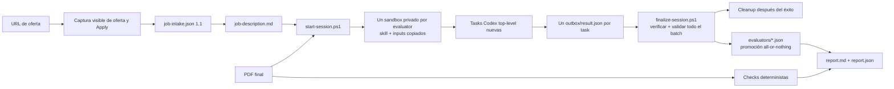

# Clean Resume QA

El mapa completo del sistema y las fronteras de acceso están en
`../docs/system-architecture-diagrams.md`. El alcance del aislamiento ligero
está fijado en `../docs/lightweight-sandbox-v1-scope.md`.

Pipeline local que usa Codex como único evaluador semántico. Acepta el PDF final
y, opcionalmente, una URL de oferta. La navegación captura únicamente contenido
visible; nunca completa ni envía la candidatura.

En un tailoring por oferta, el PDF final es
`tailoring/sessions/<session-id>/composer/resume.pdf`. El PDF de `output/pdf/`
queda disponible para QA genérico del resume canónico.

## Arquitectura v7



Cada evaluator recibe una copia de su skill y solamente sus inputs permitidos.
`job-intake.json`, navegador y artefactos deterministas permanecen en el
coordinador. La sesión durable no contiene `evaluators/` hasta que todos los
resultados seleccionados pasan verificación y validación.

Clean QA termina al validar `report.md` y `report.json`; no invoca el Resume
Composer. El repair QA-to-Composer y una segunda composición siguen fuera de
alcance y no están automatizados.

## Semántica de formulario

| Concepto | Significado |
| --- | --- |
| Required question | El formulario exige una respuesta para continuar |
| Explicit eligibility gate | La redacción pública declara una condición de elegibilidad |
| Potential auto-reject | Siempre `unknown`; no se infiere de que el campo sea obligatorio |

Las reglas de auto-rechazo se configuran aparte en Ashby. Por eso salario,
disponibilidad, visado u otra pregunta no se etiquetan como hard gate solamente
por ser obligatorios.

## Dos métricas distintas

| Métrica | Propósito |
| --- | --- |
| Job Match local, 0-100 | Evaluación ponderada de requisitos, responsabilidades, stack, seniority y calidad de evidencia |
| Ashby-style observable proxy | Porcentaje de criterios atómicos observables que el PDF demuestra |

Ninguna es un score oficial de Ashby y nunca se promedian entre sí.

Las comparaciones entre versiones se preparan solamente después de finalizar
la sesión actual. Cada fila debe identificar la sesión o PDF exacto; un PDF
modificado queda sin evaluar hasta completar una nueva sesión limpia. Los
scores anteriores nunca se incluyen en los prompts de los evaluadores.

## Artefactos

Cada sesión v7 puede incluir:

- `inputs/resume.pdf` y, cuando aplica, `inputs/job-description.md`.
- `pdf-checks.json`: página, texto extraíble, orden, enlaces y cifrado.
- `parsed-profile.json`: proyección local, no el parser privado de Ashby.
- `ashby-text-search.json`: aproximaciones locales de Matches, Contains, Equals y Similar.
- `application-readiness.json`: preguntas, respuestas conocidas o pendientes y riesgo.
- `task-prompts.md`: prompts completos con rutas privadas de cada sandbox.
- `evaluators/*.json`: batch validado y promovido desde los outboxes.
- `report.md` y `report.json`: informe combinado sin score global.

Los sandboxes efímeros viven por defecto en `.sandbox/qa/<session-id>/` y se
eliminan solamente después de una finalización correcta.

## Uso

```powershell
.\qa\resume-qa\scripts\setup.ps1

.\qa\resume-qa\scripts\new-job-intake.ps1 `
  -Url https://jobs.example.com/backend-engineer

.\qa\resume-qa\scripts\start-session.ps1 `
  -Resume tailoring/sessions/<tailoring-session-id>/composer/resume.pdf `
  -Modes technical,job-match,callback `
  -JobIntake qa/jobs/example-backend-engineer/job-intake.json

# Después de completar todos los outbox/result.json de task-prompts.md
.\qa\resume-qa\scripts\finalize-session.ps1 `
  -Session qa/sessions/<session-id>
```

`new-job-intake.ps1` crea schema 1.1. La captura debe completarse mediante
`$resume-qa`, validarse y renderizarse antes de iniciar la sesión. El validador
continúa aceptando snapshots 1.0 históricos.

## Límite del sandbox v1

Es aislamiento lógico cooperativo entre procesos del mismo usuario, orientado a
evitar mezcla accidental de contexto y promoción de resultados no validados.
Los inputs y skills copiados son read-only, tienen hashes y cada task dispone de
un único outbox declarado.

No es una frontera de seguridad del sistema operativo. No incorpora
contenedores, VMs, identidades separadas, firewall, bloqueo técnico de red,
sandboxes calientes, JSONL, telemetría, scheduler ni retries. La política de red
es declarativa y los evaluators no deben usar web.

## Límites de evaluación

- No se simulan reglas ocultas, pesos de ranking, prompts internos ni decisiones del empleador.
- Callback es un proxy local de interés y credibilidad visible, no una probabilidad real de recibir llamada.
- Fraud detection queda fuera de alcance porque depende de señales de envío como dispositivo, IP, email o teléfono.
- No se inventan respuestas ni se introducen datos en la aplicación.
- Search y parsed profile son proxies locales observables, no resultados del ATS real.

## Referencias primarias de Ashby

- https://docs.ashbyhq.com/application-forms
- https://docs.ashbyhq.com/auto-reject-applications
- https://docs.ashbyhq.com/ai-assisted-application-review
- https://docs.ashbyhq.com/candidate-search
- https://docs.ashbyhq.com/bulk-import-options
- https://docs.ashbyhq.com/candidate-fraud-detection-overview-and-admin-settings
- https://docs.ashbyhq.com/application-limits
